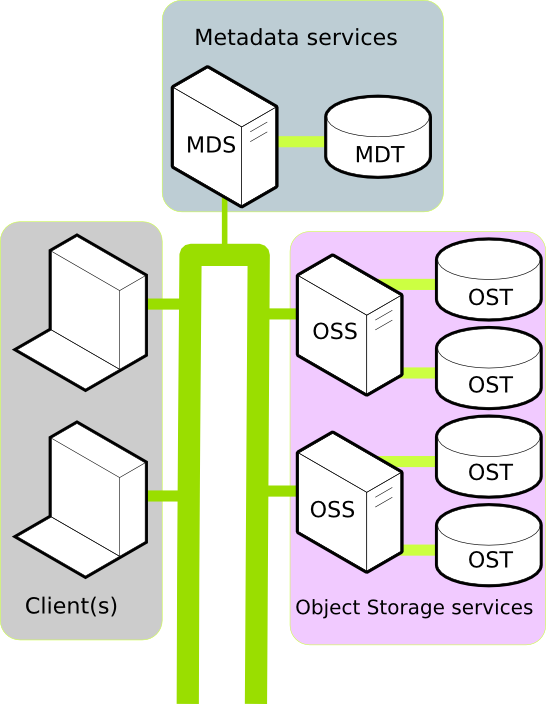
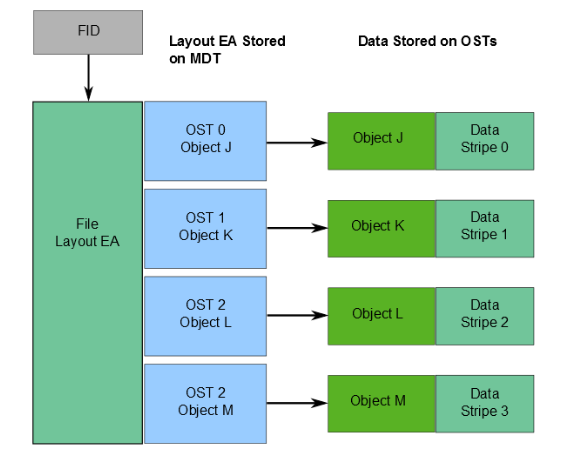
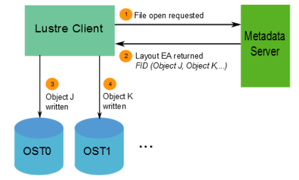
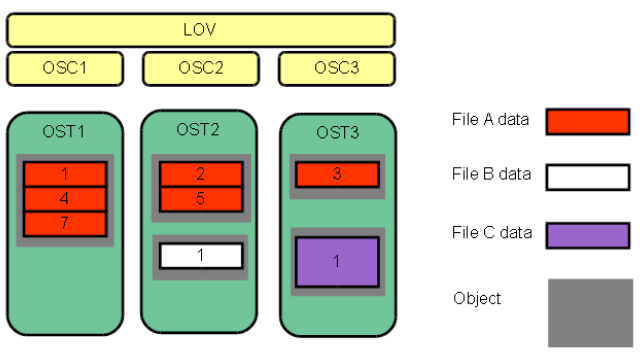

# Documentación de Lustre
### Autores: 
* Pablo Cerezo Sánchez
* Javier Escobar Cerezo

## ¿Qué es Lustre?


Lustre es un sistema de archivos distribuido de los más usados a lo largo del mundo por los grandes clusters y computadores de altas prestaciones, los cuales llegan a almacenar petabytes de información y usan velocidades de entradas/salidas del orden de Gigabytes por segundo (GB/s) pudiendo incluso alcanzarse los Terabytes por segundo (TB/s). El sistema de archivos Lustre pertenece a la licencia GNU General Public License. Destaca por ser usado en 7 de los 10 mayores supercomputadores del mundo.

Una de sus principales características es que puede dar servicio como máximo entre 10000 y 20000 clientes. Se puede usar especialmente en casos en los que se sobrepasa la capacidad que un solo servidor puede proporcionar.

Lustre está compuesto por varias máquinas conectadas entre sí, cada una con un papel concreto. Puede funcionar en una gran variedad de kernels y su escalabilidad depende del número de nodos clientes, almacenamiento en disco y el ancho de banda.

## Componentes de Lustre
- **Cliente**: Es desde donde se hacen las peticiones a Lustre para obtener los datos. El nivel de abstracción permite hacer que parezca que el sistema de archivos estuviera localmente en él.
    - Proporciona una interfaz entre el sistema de archivos Linux y los servidores Lustre.

- **Metadata Targets(MDT)**: Almacena los metadatos adjuntándolos a los servidores MDS. Varios MDS pueden acceder a un MDT, pero sólo uno a la vez. Si un MDS fallara, otro servidor MDS disponible podría realizar el servicio correspondiente accediendo al MDT y de esta forma hacerlo accesible para los clientes, lo que implica una importante disponibilidad.

- **Metadata Servers(MDS)**: es un servidor que conecta con la base de datos MDT y maneja los nombres y directorios en el sistema de archivos Lustre. 

- **Object Storage Target(OST)**: Los archivos de los usuarios se encapsulan en objetos y cada objeto se almacena se almacena en un OST distinto. El usuario puede configurar el número de objetos por archivo.

- **Object Storage Servers(OSS)**: Proporcionan servicios de entrada/salida para archivos para uno ó más OST's. Cada OSS suele servir entre 2 y 8 OST's hasta 16TiB.

    Un esquema básico de la estructura de Lustre es el siguiente:

    

## Red de Lustre:
La comunicación entre los clientes Lustre y los distintos servidores se hace a través del sistema Lustre Networking (LNet).

- ### Características clave de LNet:
    - **RDMA**: Posibilidad de acceso directo a memoria de forma remota (*Remote Direct Access Memory*).
    - Soporta distintos tipos de red muy comunes: **TCP**, **InfiniBand**, **RapidArray** y **Quadrics**.
    - Alta disponibilidad y posibilidad de recuperación (*recovery*).
    - Soporta distintos tipos de red simultáneamente.

    La red de Lustre comprende dos capas de abstracción: LNet y LND.
    - LNet es la capa que está por encima y aislada , es asíncrona y no verifica que los datos se hayan transmitido correctamente. Se identifica por una etiqueta formada por un string que corresponde a un LND seguido de un número.
    - Por otro lado LND está a un nivel más bajo de abstracción y está orientado a la conexión, por lo que verfica la correcta transmisión de datos.

    Cada nodo en Lustre contiene al menos un identificador de red formado por una dirección de la interfaz de red, seguido del símbolo '@' y una etiqueta LNet (*dirección@etiqueta_LNet*).

## Almacenamiento y entradas/salidas en Lustre
En Lustre cada archivo contiene una identificación formada por una secuencia de números llamada FID (*File Identifier*) que los hace únicos en todo el sistema de archivos.

La información que nos indica dónde se guardan los datos de los archivos dentro de los OST's se almacena en un atributo llamado "layout EA" el cual se guarda en un MDT, y se identifica por el FID del archivo al que se refiere. 

Un EA básicamente es una estructura que nos indica:
* Nombre del archivo.
* Puntero al objeto donde se almacena.

Podemos reflejar toda esta estructura de almacenamiento y funcionamiento en las siguientes imágenes:

* **Diseño del almacenamiento de datos con EA:**




* **Obtención de datos para lectura/escritura:**



Otro concepto importante en cuanto al almacenamiento es el "_Striping_":
* El destripamiento (o Striping en inglés) es una de las grandes ventajas de Lustre en cuanto almacenamiento. El usuario puede configurar cómo "trocear" los objetos donde los usuarios guardan los datos de sus archivos en distintas partes según las capacidades de memoria de cada servidor OST. Es decir, si un archivo tiene un tamaño que sobrepasa la memoria máxima disponible de un OST, se guardaría la porción (o porciones) del objeto en cuestión en él y almacenaríamos las demás partes del objeto en otro OST.



Con esta técnica de destripamiento podemos ser capaces de guardar archivos del orden de Terabytes o incluso Petabytes dependiendo del sistema de archivos que usemos de forma local en cada servidor (para el caso de ldiskfs podemos usar objetos de hasta 16 TiB pudiendo alcanzar tamaños de archivos de hasta 31'25 PiB, o en el caso de ZFS tenemos objetos de hasta 156PiB y archivos de hasta EiB). Por tanto, la escalabilidad del almacenamiento viene determinada por la cantidad de nodos OSS/OST que dispongamos.

# Instalando Lustre

En esta pequeña guía vamos instalar y configurar un pequeño sistema Lustre con estas características:
 * Un servidor MGS/MDT 
 * Un servidor OSS/OST
 * Dos máquinas clientes
 * Ambos servidores tienen dos discos cada uno, uno para el SO y otro para el sistema de archivos de lustre.

## Preparando los servidores y clientes

* Cada servidor MGS/MDT y OSS/OST necesita un disco al menos a parte donde montar las particiones de Lustre.
* Instalar una distribución linux compatible, en nuestro caso CentOS 7 minimal.
* Asegurarse de tener configuradas las interfaces de redes y que todas las máquinas se ven unas a otras y tienen acceso a internet.
* Deshabilitar SELinux ya que Lustre no lo soporta. Modificar */etc/sysconfig/selinux*
  ```
    SELINUX=disabled
  ```
* Desactivar el cortafuegos o abrir el puerto 988 (Lustre usa ese puerto).
* Instalar dependencias y herramientas útiles en los servidores:
  ```
  yum -y install perl libgssglue net-snmp libyaml sg3_utils openmpi lsof rsync
  yum -y install wget net-tools telnet 
  ```
* Asegurarse de que las máquinas no tengan una *non-loopback entry* en */etc/hosts*:
   ```
   echo "" > /etc/hosts
   ```

## Instalación de los Servidores MGS/MDT y OSS/OST

En esta guía trabajaremos con la versión 2.10 de Lustre. Esta instalación debe llevarse a cabo en todos los nodos salvo los cliente.

Primero necesitamos descargarnos todos los archivos necesarios. Recomendamos crear un archivo con todos los enlaces para facilitar la tarea de descarga:

```
https://downloads.whamcloud.com/public/lustre/latest-release/el7/server/RPMS/x86_64/kernel-3.10.0-957.1.3.el7_lustre.x86_64.rpm
https://downloads.whamcloud.com/public/lustre/latest-2.10-release/el7/server/RPMS/x86_64/lustre-2.10.7-1.el7.x86_64.rpm
https://downloads.whamcloud.com/public/lustre/latest-release/el7/server/RPMS/x86_64/lustre-iokit-2.10.7-1.el7.x86_64.rpm
https://downloads.whamcloud.com/public/lustre/latest-release/el7/server/RPMS/x86_64/lustre-osd-ldiskfs-mount-2.10.7-1.el7.x86_64.rpm
https://downloads.whamcloud.com/public/lustre/latest-release/el7/server/RPMS/x86_64/lustre-tests-2.10.7-1.el7.x86_64.rpm
https://downloads.whamcloud.com/public/lustre/latest-release/el7/server/RPMS/x86_64/kmod-lustre-2.10.7-1.el7.x86_64.rpm
https://downloads.whamcloud.com/public/lustre/latest-release/el7/server/RPMS/x86_64/kmod-lustre-osd-ldiskfs-2.10.7-1.el7.x86_64.rpm
https://downloads.whamcloud.com/public/lustre/latest-release/el7/server/RPMS/x86_64/kmod-lustre-tests-2.10.7-1.el7.x86_64.rpm

https://downloads.whamcloud.com/public/e2fsprogs/latest/el7/RPMS/x86_64/e2fsprogs-1.44.5.wc1-0.el7.x86_64.rpm
https://downloads.whamcloud.com/public/e2fsprogs/latest/el7/RPMS/x86_64/e2fsprogs-libs-1.44.5.wc1-0.el7.x86_64.rpm
https://downloads.whamcloud.com/public/e2fsprogs/latest/el7/RPMS/x86_64/libcom_err-1.44.5.wc1-0.el7.x86_64.rpm
https://downloads.whamcloud.com/public/e2fsprogs/latest/el7/RPMS/x86_64/libss-1.44.5.wc1-0.el7.x86_64.rpm
```

Y para descargarlos ejecutamos:
```
wget -i enlaces.txt
```

Lo primero es instalar y cambiar al nuevo kernel del sistema:
```
yum localinstall kernel-3.10.0-957.1.3.el7_lustre.x86_64.rpm
/sbin/new-kernel-pkg --package kernel --mkinitrd --dracut --depmod --install 3.10.0-957.1.3.el7_lustre.x86_64
shutdown -r now
```

En este punto necesitamos reiniciar y añadir el segundo disco si no lo habéis hecho ya.

Instalamos *e2fsprogs* (proporcionar herramientas para trabajar con ext2/ext3/ext4)
```
yum localinstall e2fsprogs-1.44.5.wc1-0.el7.x86_64.rpm e2fsprogs-libs-1.44.5.wc1-0.el7.x86_64.rpm libcom_err-1.44.5.wc1-0.el7.x86_64.rpm
libss-1.44.5.wc1-0.el7.x86_64.rpm
```

Finalmente instalamos el resto de modulos descargados:
```
yum localinstall lustre-2.10.7-1.el7.x86_64.rpm lustre-iokit-2.10.7-1.el7.x86_64.rpm lustre-osd-ldiskfs-mount-2.10.7-1.el7.x86_64.rpm lustre-tests-2.10.7-1.el7.x86_64.rpm kmod-lustre-2.10.7-1.el7.x86_64.rpm kmod-lustre-client-2.10.7-1.el7.x86_64.rpm kmod-lustre-osd-ldiskfs-2.10.7-1.el7.x86_64.rpm kmod-lustre-tests-2.10.7-1.el7.x86_64.rpm
```

Si ocurre algún fallo probablemente sea que os falte algún archivo por descargar.

## Configuración del Servidor MGS/MDT

Creamos el fichero */etc/modprobe.d/lustre.conf* con el siguiente contenido:
```
options lnet networks=tcp
```

Cargamos los módulos de lustre:
```
modprobe -v lustre
```

Formateamos el dispositivo de almacenamiento donde vayamos a guardar los metadatos(el nuestro es /dev/sdb):
```
mkfs.lustre --fsname=lustre --mgs --mdt --index=0 /dev/sdb
```

Creamos un directorio para montar el disco formateado en Lustre, en este caso tenemos libertad y podríamos crearlo donde quisieramos, y finalmente lo montamos:
```
mkdir /mnt/mdt
mount -t lustre /dev/sdb /mnt/mdt/
```

Podemos observar que efectivamente se ha montado el disco formateado en Lustre escribiendo:
```
mount
```

Y para que se monte al iniciar el nodo añadiremos a */etc/fstab* la siguiente línea:
```
/dev/sdb /mnt/mdt lustre defaults 0 0
```

## Configuración del Servidor OSS/OST

La configuración del OSS/OST es casi idéntica hasta la parte de formatear los discos. Si estáis trabajando con máquinas virtuales podríais clonar el servidor MGS/MDT y sólo faltaría cambiar su IP y formatear su disco como mostramos a continuación. De todas formas volvemos a dejar los pasos en esta sección también.

Creamos el fichero */etc/modprobe.d/lustre.conf* con el siguiente contenido:
```
options lnet networks=tcp
```

Cargamos los módulos de lustre:
```
modprobe -v lustre
```

Formateamos el dispositivo de almacenamiento donde vayamos a guardar los datos(el nuestro es /dev/sdb). Importante sustituir la IP de *mgsnode* por la IP de vuestro MGS/MDT:
```
mkfs.lustre --fsname=lustre --mgsnode=192.168.1.150@tcp --ost --index=1 /dev/sdb
```

Creamos un directorio para montar el disco formateado en Lustre, en este caso tenemos libertad y podríamos crearlo donde quisieramos, y finalmente lo montamos:
```
mkdir /lustre
mount -t lustre /dev/sdb /lustre
```

Podemos observar que efectivamente se ha montado el disco formateado en Lustre escribiendo:
```
mount
```

Y para que se monte al iniciar el nodo añadiremos a */etc/fstab* la siguiente línea:
```
/dev/sdb /lustre lustre defaults 0 0
```

## Instalando y configurando el cliente de Lustre

Descargamos los archivos de estos enlaces:

```
https://downloads.whamcloud.com/public/lustre/latest-2.10-release/el7/client/RPMS/x86_64/lustre-client-tests-2.10.7-1.el7.x86_64.rpm
https://downloads.whamcloud.com/public/lustre/latest-2.10-release/el7/client/RPMS/x86_64/lustre-client-2.10.7-1.el7.x86_64.rpm
https://downloads.whamcloud.com/public/lustre/latest-2.10-release/el7/client/RPMS/x86_64/kmod-lustre-client-tests-2.10.7-1.el7.x86_64.rpm
https://downloads.whamcloud.com/public/lustre/latest-2.10-release/el7/client/RPMS/x86_64/kmod-lustre-client-2.10.7-1.el7.x86_64.rpm
https://downloads.whamcloud.com/public/lustre/latest-2.10-release/el7/client/RPMS/x86_64/lustre-iokit-2.10.7-1.el7.x86_64.rpm
```
Si los guardamos en *enlaces.txt* podemos ejecutar:
```
wget -i enlaces.txt
```

Instalamos
```
yum localinstall lustre-client-2.10.7-1.el7.x86_64.rpm lustre-iokit-2.10.7-1.el7.x86_64.rpm lustre-client-tests-2.10.7-1.el7.x86_64.rpm kmod-lustre-client-tests-2.10.7-1.el7.x86_64.rpm kmod-lustre-client-2.10.7-1.el7.x86_64.rpm
```

Finalmente debemos montar el sistema de ficheros lustre y usar la IP de MGS/MDT:
```
mkdir /lustre
mount -t lustre 192.168.1.150@tcp:/lustre /lustre
```

## Prueba de funcionamiento

Un sencillo test consiste en crear y modificar el mismo archivo desde dos clientes diferentes y no notar la diferencia a que el archivo estuviese en la máquina local.
```
[root@cliente2 lustre]# for i in `seq 1 5`;do echo cliente2>>prueba.txt; done
[root@cliente1 lustre]# for i in `seq 1 5`;do echo cliente1>>prueba.txt ; done
```
## Bibliografía
* Lustre Software Release 2.x - Operations Manual
* Referencias en internet:
    * https://www.unixgr.com/what-is-lustre/
    * https://www.unixgr.com/some-lustre-fs-basics/
    * https://wiki.debian.org/Lustre